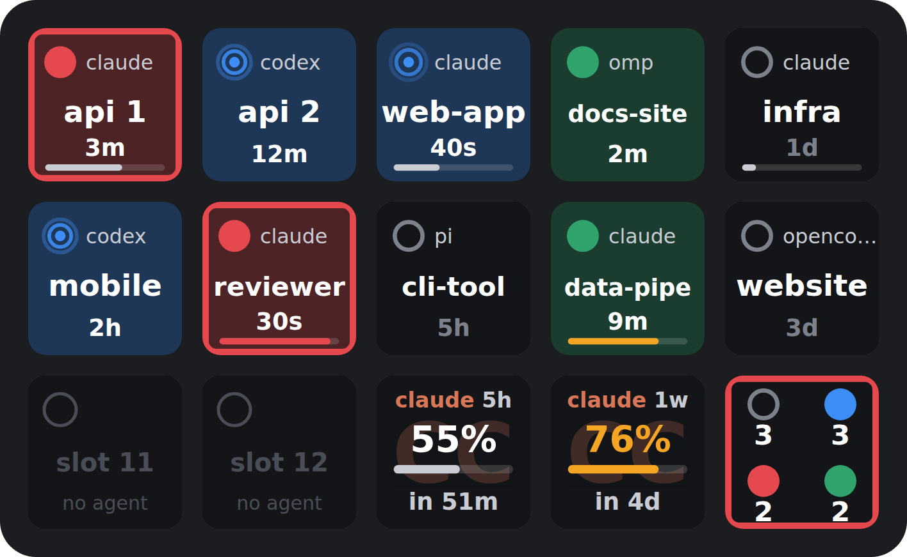

# opendeck-herdr-plugin

Live [herdr](https://herdr.dev) agent status on an Elgato Stream Deck, for
[OpenDeck](https://github.com/nekename/OpenDeck) on **Linux** (and macOS).



Each key is one agent: a status dot, the agent type, a label, and how long it has
been in its current state. When an agent stops and wants you, its key turns red
and blinks. Press a key to jump straight to that agent's pane; the plugin also brings your
terminal window to the front.

| Status    | Key                     | Meaning                          |
| --------- | ----------------------- | -------------------------------- |
| `blocked` | red, outlined, blinking | waiting for your input           |
| `working` | blue                    | running                          |
| `done`    | green                   | finished, you haven't looked yet |
| `idle`    | dark, hollow dot        | nothing going on                 |

The label is the herdr agent name if you set one (`herdr agent rename <pane> <name>`),
otherwise the workspace name, numbered when a workspace has several agents (`api 1`, `api 2`).
The elapsed time counts from when the plugin saw the status change: herdr doesn't expose timestamps.

## Actions

- **Agent**: one agent per key. Choose how a key picks its agent:
  - *Slot, herdr order* (default): slot N is the Nth agent in herdr's workspace/pane order, so keys stay put.
  - *Slot, most urgent first*: slot 1 is whichever agent most needs you. Keys reorder as states change.
  - *A specific agent*: pinned to one agent. It's matched by agent session, so the pin survives a herdr restart.

  New keys take the next free slot automatically. Options: skip idle agents, blink when blocked, tinted or plain background, show the pane title instead of the agent type, context bar.
- **Summary**: counts agents per status and turns red when any agent is blocked. Press it to jump to the most urgent agent.
- **Usage**: plan usage in the current window (Claude's 5-hour limit) and time until it resets. Needs a [harness adapter](#harness-adapters).

## Harness adapters

herdr knows each agent's status, but not its model or how full its context window is. Adapters
report those to herdr as pane tokens, and the plugin reads them from herdr. With an adapter, agent
keys get a **context bar** along the bottom edge (grey, amber above 70%, red above 90%), and the
**Usage** key works.

**Claude Code**: use [`integrations/claude-code/statusline.sh`](integrations/claude-code/statusline.sh)
as your status line (needs `jq`). In `~/.claude/settings.json`:

```json
"statusLine": { "type": "command", "command": "/path/to/opendeck-herdr-plugin/integrations/claude-code/statusline.sh" }
```

It prints a short `[model] 42% context` line. To keep your own status line, append its command:
`.../statusline.sh ~/.claude/my-statusline.sh`. Claude Code updates the status line after each
message, so the bar follows with that delay. Outside herdr the script only prints the status line.

Codex and omp adapters are planned; the token names are in [docs/plan.md](docs/plan.md).

## Requirements

- herdr 0.9+ running locally (the plugin talks to its socket API; it does not need `herdr` on `PATH`)
- OpenDeck 2.x
- Recommended on X11: `wmctrl` (`sudo apt install wmctrl`), so a key press can bring your terminal to the front. Without it everything else works.
- Node.js 22+. The launcher also finds nvm, fnm, volta, mise and Homebrew installs, which desktop-launched apps usually can't see. Set `HERDR_DECK_NODE=/path/to/node` to force one.

## Install

From source (there's no packaged release yet):

```sh
git clone https://github.com/cdcxd/opendeck-herdr-plugin
cd opendeck-herdr-plugin
npm install
npm run deploy   # builds and copies the plugin into OpenDeck's plugin folder (native or Flatpak)
```

Or run `npm run package` and install `dist/io.github.cdcxd.herdr.streamDeckPlugin` with **Plugins → Install from file** in OpenDeck.

Then fully restart OpenDeck. Closing the window only hides it in the tray, so use **Quit** from the tray (or `pkill -x opendeck`). The **herdr** category then appears in the actions list; drag **Agent** and **Summary** onto keys.

## Settings

Per key settings are described under Actions. These settings apply to every key:

- **Bring terminal to front** (on by default): herdr only switches panes inside itself, so after a press the plugin raises the terminal window too. It finds the terminal from the process tree: the window that owns the running `herdr` client. On X11 this uses `wmctrl`; on macOS, System Events (grant OpenDeck Accessibility access if asked).
- **Custom raise command**: a shell command that replaces the automatic raise. Use it where that can't work:
  - GNOME on Wayland: requires an extension such as *Activate Window By Title*
  - several terminal windows, to pick one: `wmctrl -xa ghostty` (use your terminal's WM class)
- **herdr session / Socket path**: for named sessions or a non-default socket. The default is `$XDG_CONFIG_HOME/herdr/herdr.sock`, falling back to `~/.config/herdr/herdr.sock`.

## How it works

The plugin has no runtime dependencies. It talks to herdr's newline-delimited JSON socket API: it reads `agent.list` and `workspace.list`, and subscribes to `pane.agent_status_changed` and pane/workspace lifecycle events so keys update immediately. A 5 s poll catches anything missed and handles herdr restarts. Keys are drawn as SVG and redrawn only when they change, including at the moment an elapsed-time label ticks over.

Adapter tokens come back in `agent.list`, so they need no extra connection. herdr has no event for token changes, so they arrive with the 5 s poll.

Planned work (more adapters, approving from the deck) is in [docs/plan.md](docs/plan.md).

## Troubleshooting

- Keys say **herdr offline**: check that herdr is running and that the socket path matches (`echo $HERDR_SOCKET_PATH` inside a herdr pane).
- Actions don't appear: OpenDeck only scans plugins at startup, so quit it completely and start it again.
- Press focuses the pane but the terminal stays behind: install `wmctrl` (X11). The plugin log says why a raise failed.
- Plugin doesn't start: check `~/.local/share/opendeck/logs/plugins/io.github.cdcxd.herdr.sdPlugin.log`. A "no Node.js 22+ found" message there means you need to set `HERDR_DECK_NODE`.

## Development

TypeScript, no runtime dependencies. Node.js 22.18+ runs the tests directly from `.ts`.

```text
src/          plugin (plugin.ts) and property inspector (pi/) sources
integrations/ harness adapters that report model/context/usage to herdr
assets/       manifest, launcher, icons, property inspector HTML/CSS
test/         node:test suites, including a fake herdr socket server
dist/         build output: io.github.cdcxd.herdr.sdPlugin/ (the loadable plugin folder)
```

```sh
npm run check     # typecheck + tests
npm run deploy    # build and install into OpenDeck
npm run package   # dist/io.github.cdcxd.herdr.streamDeckPlugin
```

Stream Deck hosts load a folder named `<plugin uuid>.sdPlugin`; that folder is generated in `dist/`, so the repo itself stays flat. Pushing a `v*` tag builds the package and attaches it to a GitHub release.
